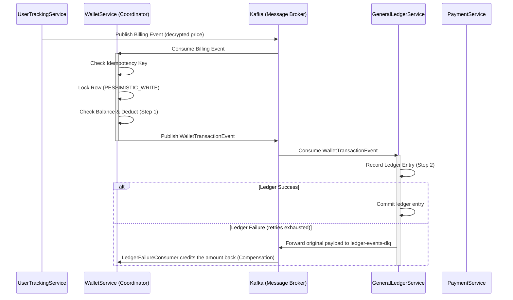
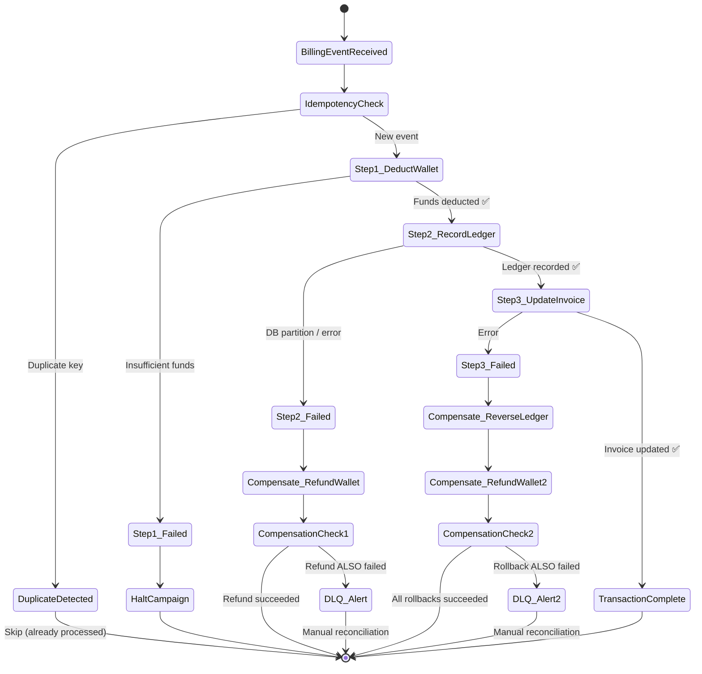

# Wallet & Financial Service (WalletService)

## Overview
The `WalletService` is a centralized, microservice-based financial component responsible for managing balances, processing transactions, and coordinating distributed transactions (Sagas) across the entire Food Delivery ecosystem. It handles financial accounts for Customers, Restaurants, Drivers, and Advertisers.

For the Advertisement Platform, it ensures strict financial integrity when deducting campaign spend based on real-time bidding outcomes and interactions, interacting closely with the `GeneralLedgerService` and `PaymentService`.

## Core Responsibilities
- **Balance Management**: Maintains strict ACID-compliant generic fund balances for all platform entities.
- **Saga Pattern Coordinator**: Orchestrates distributed financial transactions to ensure consistency across microservices without relying on traditional two-phase commits.
- **Advertising Billing Models**: Supports flexible, real-time billing triggers:
  - **CPM (Cost Per Mille)**: Triggered by billable impression renders using the decrypted clearing price.
  - **CPC (Cost Per Click)**: Triggered by validated click events.
  - **CPA (Cost Per Acquisition)**: Triggered by validated conversion events.
- **Idempotency**: Strictly enforces idempotency across all ledger and payment workflows to eliminate risks of double-crediting or double-debiting.

## Architecture & Integration (Saga Pattern)
The `WalletService` listens for billing events generated by the `UserTrackingService` (via Apache Kafka) and coordinates the transaction lifecycle.

**Win Notification → Billing Saga Flow:**
1. **Deduct Funds**: `WalletService` attempts to deduct the decrypted clearing price from the advertiser's balance (using pessimistic row locking).
    - If insufficient funds, the campaign bidding is immediately halted. No compensating transaction is needed.
2. **Record Ledger**: If deduction succeeds, it calls `GeneralLedgerService` to record a debit entry for tax compliance and accounting.
    - If this fails, a compensating transaction (Refund Credit) is issued in `WalletService`.
3. **Update Invoice**: If ledger recording succeeds, it calls `PaymentService` to update the final invoice status.
    - If this fails, compensating transactions are issued to reverse the ledger entry and refund the wallet.

### Complete Saga Failure Paths (Compensating Transactions)
All possible success and failure paths for the financial saga:

## Resilience & Edge Cases
- **Financial Precision**: Strictly uses `BigDecimal` for all computations. Floating-point types (`float`/`double`) are completely prohibited to prevent fractional revenue leakage.
- **Fail Fast & No Defaults (CRITICAL)**: Never uses hardcoded fallback values (e.g., 5.0, 0.0, "default") for financial parameters if upstream calculations or price decryption fails. Immediately throws `IllegalArgumentException` or `IllegalStateException`.
- **Negative Balance Prevention**: Enforced via row-level pessimistic locking during concurrent deductions.
- **Circuit Breaker / DLQ**: Rollback failures are sent to a Dead Letter Queue with exponential backoff retries and alert finance operations.

## Ecosystem Integration Points
How this service integrates with the broader Food Delivery platform:

- **LedgerService (Double-Entry Accounting)**: `WalletService` emits `AggregateType.LEDGER` + `EventType.LEDGER_TRANSACTION_REQUEST` events to the existing LedgerService. This fully reuses the platform's existing double-entry ledger without requiring custom changes to LedgerService. 
  - Ex: `DEBIT: ADVERTISER_WALLET → CREDIT: PLATFORM (AD_REVENUE)` for impressions/clicks.
- **PaymentService (Wallet Top-Up)**: Calls `PaymentService` to create a payment intent. Upon successful payment webhook, it credits the `ADVERTISER_WALLET` and publishes a ledger transaction.
- **CommonLibrary**: Relies on shared constants (`TOPIC_AD_BILLING_EVENTS`), `AccountType.ADVERTISER_WALLET(50)`, and `ChargeCategory` (e.g., `AD_IMPRESSION(120)`, `AD_CLICK(130)`).
